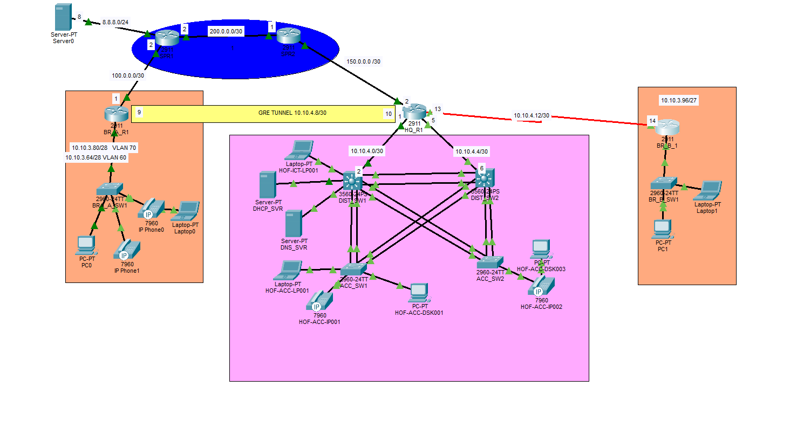

#Enterprise Network Infrastructure Design: GlobalNet International

##Network Topology

---

## 1. Project Scenario & Business Profile
GlobalNet International** is a rapidly expanding global logistics and supply chain enterprise coordinating freight forwarding and customs brokerage across multiple sites. To support transactional growth and secure central resources, this project details the implementation of a highly available, secure, multi-site hybrid network topology.

### Business Challenges Solved:
* Eliminated Single Points of Failure:** Replaced vulnerable infrastructure with core gateway and link redundancy.
* Network Segregation:** Separated high-profile data, voice, and management systems to stop unauthorized internal access.
* WAN Integration:** Successfully connected a high-security segmented branch (via GRE Tunneling) and a legacy branch (via P2P Serial) into one cohesive routing fabric.

---

##  2. Core Technologies Implemented

### High Availability & Layer 2 Core
* **HSRP (Hot Standby Router Protocol)** - Default gateway redundancy at the Core switches.
* **LACP EtherChannel** - Aggregating physical switch uplinks for high-bandwidth load-balancing.
* **IEEE 802.1Q VLAN Trunking** & Dedicated Native VLAN 99 configuration.
* **VLAN Segmentation** - Logical isolation of Management (10), Servers/Data (20), Voice (30), and Branch structures (60/70).

### Advanced Security Hardening
* **DHCP Snooping** - Defeating rogue DHCP server deployments at the access layer.
* **Dynamic ARP Inspection (DAI)** - Mitigating Man-in-the-Middle (MITM) ARP poisoning attacks.
* **Cisco Switchport Port Security** - Enforcing MAC limits of 3 with Sticky MAC address learning.
* **Extended Access Control Lists (ACLs)** - Deploying `SERVER_FARM_PROTECTION` to insulate central databases.
* **Control Plane Security** - SSHv2 enforcement, Console/VTY line hardening, and local Privilege 15 access.

### Routing & WAN Connectivity
* **OSPFv2 (Area 0)** - Dynamic routing engine providing fast network-wide convergence.
* **OSPF Passive Interfaces** - Blocking routing advertisements on user and voice ports for edge security.
* **OSPF Default Route Propagation** (`default-information originate`) via Edge static routes.
* **GRE (Generic Routing Encapsulation) Tunneling** - Virtual private WAN overlay for Branch A.
* **Router-on-a-Stick (ROAS)** - Subinterface routing for remote branches.
* **Point-to-Point (P2P) Serial Links** - Legacy WAN transport for Branch B.

---

